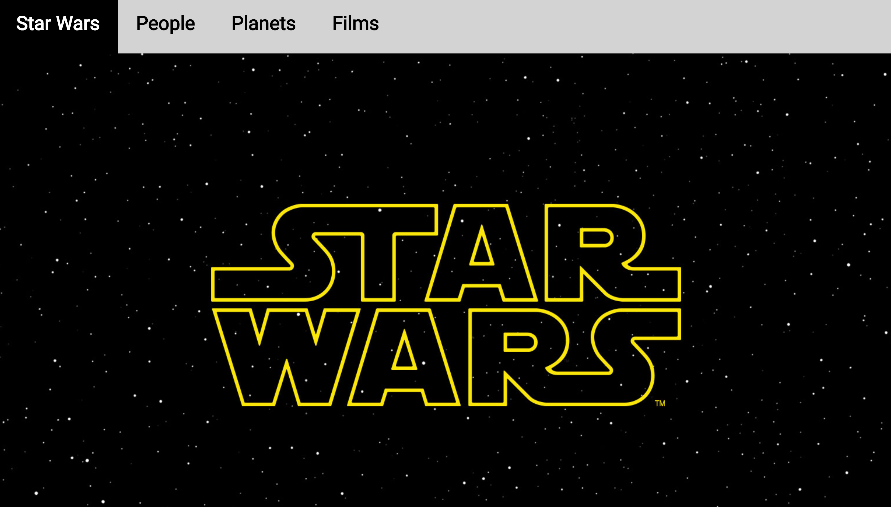

# Star Wars Web App

The purpose of the app is to use React Router to create a multi-page application based on client side routing. The application will serve users information about Star Wars categorized into groups of Characters, Planets, and Film evolving around the subject.

The application you write should contain three main structural elements, each of which is described below.  Importantly, you must use React Router to implement the application's navigational features.

## Navbar

The navbar should span the top of the application and should contain four things: a site title that links to the application's homepage (i.e. the root URL path, `/`), and three links to navigate to each of the "people", "planets", and "films" pages.  The link corresponding to the page that's currently "active" should be highlighted.

## Sidebar

The sidebar should be positioned along the left side of the page and should contain a list of all of the  elements in the data category corresponding to the "active" link in the navbar.  In other words, if the user clicks the "people" link in the navbar, then a list of all of the characters from `people.json` should appear in the sidebar.  The data elements in the sidebar should be listed by name/title, as appropriate.

Each data element in the sidebar should be a link that functions as described below.  As with the navbar, the "active" sidebar link should be highlighted.

If you can, try to implement the sidebar in such a way that it can be scrolled independently of the rest of the page.

## Main content pane

The main content pane should be positioned at the center of the application.  It should occupy all of the viewport space not occupied by the navbar or the sidebar.  When the user clicks on one of the sidebar links, a detailed view of the corresponding data element should be displayed in the main content pane.  This detailed view should display all data fields for the corresponding data element.  With this in mind, it probably makes sense to implement a separate component to display each different type of data.

For all data types, any data fields that hold an array should be rendered as an unordered list, and any data fields that refer to other data elements should be rendered as links to those elements.  For example, a person's `homeworld` field should be rendered as a link to the corresponding planet, and a film's `characters` field should be rendered as an unordered list of links to the corresponding people.

If no element from the sidebar is "active" (e.g. when the user first clicks a link in the navbar), then the main content pane should either be empty, or it should contain some simple text related to the "active" navbar link.

## Other details

If the user navigates to the root URL path (i.e. `/`, the application's "homepage") you should do either one of two things:
  * Redirect to a link corresponding to one of the three data categories (e.g. `/people`).  You should not redirect to a specific data element, only to a data category (i.e. this redirect should not result in a specific data element being displayed in the main content pane).
  * Display a simple page with some basic text about the application.  This page should *NOT* display the sidebar, but it *should* still have the navbar.

In addition, you should implement a very basic 404 page to handle any URLs that don't correspond to pages in your application.  The 404 page should also *NOT* display the sidebar, but it should still have the navbar.

## Application styling

You will need to write CSS to implement some of the features described above.  However, beyond the very broad description above, there are no strict requirements about how the application should be styled.  You can use the application mock above as inspiration, but there's no need to closely match its styling.  In general, don't worry about implementing a highly polished application in terms of styling.  In other words, your application can be minimally styled, as long as it satisfies the requirements described above.

## Project Demo

    

Or go to https://forgreatness.github.io/star_wars_web_app to visit the app hosted by git pages.  

## Authors

* **Danh Nguyen** - *Initial work* - [forgreatness](https://github.com/forgreatness)
